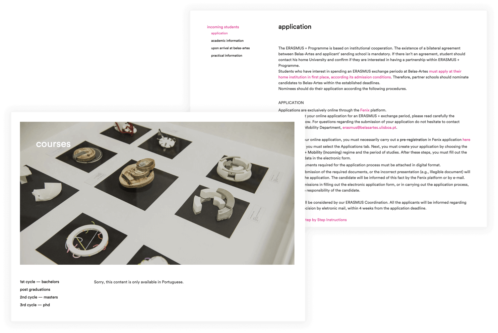
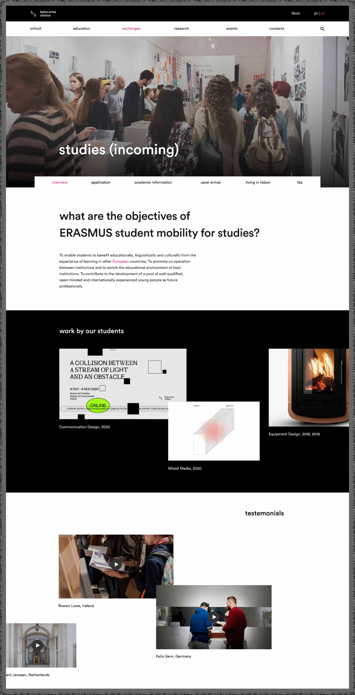
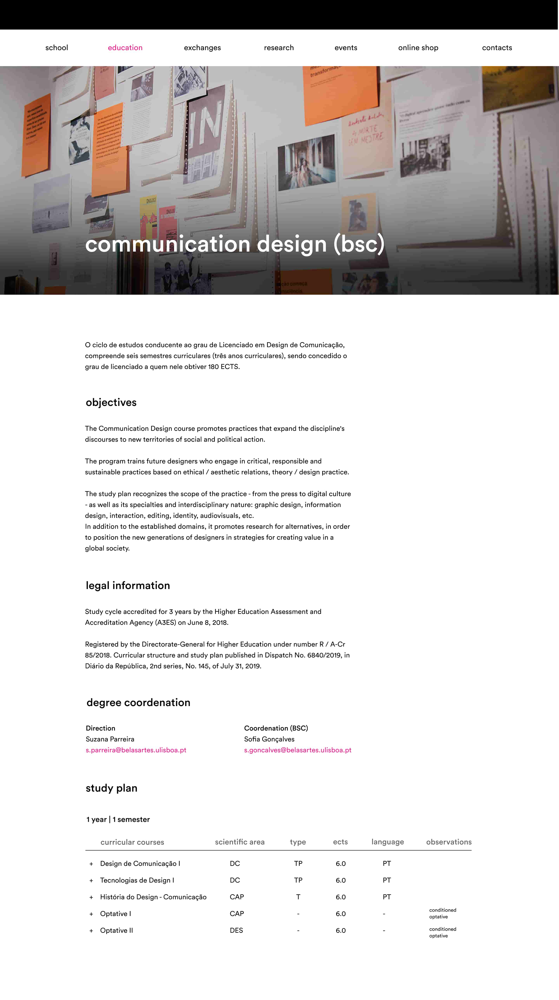

<section>
    <h1>Rethinking FBAUL's website</h1>
    <h2>Erasmus Students Incoming</h2>
</section>

    <h3>Authors</h3>
    <ul>
        <li>Ana Campos</li>
        <li>Daniel Roxo</li>
        <li>Patrícia Custódio</li>
        <li>Rafael Montoito</li>
        <li>Rita Marques</li>
    </ul>

    <h3>Overview</h3>

    
belasartes.ulisboa.pt is the institutional website of the Faculty of Fine Arts of the University of Lisbon (FBAUL).

    
This project aims to develop proposals to improve the experience of its users. To this end, we decided to focus on the experience of international participating users of the Erasmus + program who have chosen FBAUL as a host institution.

    <h3>FBAUL website analysis</h3>
    <ul>
        <li>Most menu pages do not have translated content in English;</li>
        <li>Relevant content is difficult to find and is only available in PDF;</li>
        <li>Some pages are not linked and therefore cannot be accessed;</li>
        <li>There is no information in English on the contents of each curricular unit, or on spaces of the faculty;</li>
        <li>The titles have the same visual weight as the text and the links are the same color as the highlighted content.</li>
    </ul>

<figure>
    
 </figure>

    <h3>Benchmarking</h3>
    
12 websites of national and international competing institutions were analysed. 
    The websites that offered a better user experience were those that had a clear structure and information hierarchy, were entirely translated to english and provided relevant information about the facilities, country and procedures.

 <figure>
    
 </figure>

<h3>Interviews</h3>
    
To better understand the needs and frustrations of these students, the team conducted interviews and surveys with students who participated in the ERASMUS program at FBAUL and with the Erasmus program coordinator of the faculty.
    The insights were then divided into 5 categories: Erasmus Experience; The School; Subjects; The Website; Website's Content.

 <figure>
    
 </figure>

 <h3>Mockups</h3>

 <figure>
    
 </figure>

  <figure>
    
 </figure>

    <h3>View the entire case study on behance! <a href="https://www.behance.net/gallery/115498809/Rethinking-FBAULs-Website" target="blank">Rethinking FBAUL's Website Case Study</a></h3>

