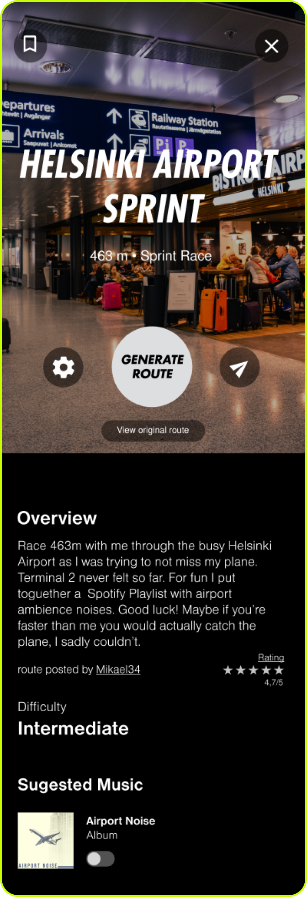
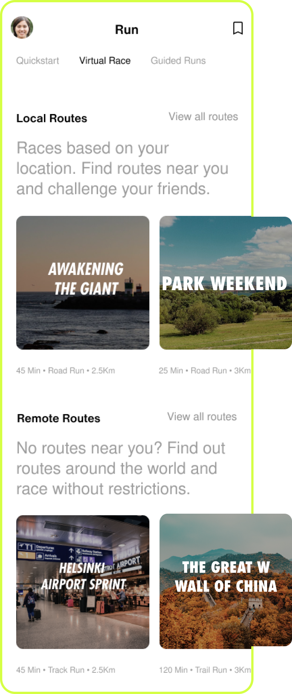

<section>
    <h1>Virtual Races</h1>
    <h2>A new feature for Nike Run Club</h2>
</section>

    <h3>Authors</h3>
    <ul>
        <li>Ana Campos</li>
        <li>Alice Miranda</li>
        <li>Inês Gonçalves</li>
    </ul>

    <h3>What is Nike Run Club?</h3>

    
NRC is a running app that offers detailed progress tracking, social features, personalized coaching and guided runs that motivate and inspire people to become better athletes.

    <h3>The Challenge</h3>

    
Creating a new feature for NRC that can improve the runner’s experience, be inovative and complement the features that the app already offers.

    <figure>
        
    </figure>
    <figure>
        
    </figure>

    <h3>The Idea</h3>

    
With Virtual Races you can search and run popular routes near you, competing with other users that ran the same route.

    <h3>No routes near you? No problem! </h3>

    
A route can be generated by the app, according to your requirements and have users from all around the world competing.

<section>
    <h3>View the entire case study on behance! <a href="https://www.behance.net/gallery/116896087/Nike-Run-Club-Virtual-Races-Feature" target="blank">Virtual Runs Case Study</a></h3>
</section>